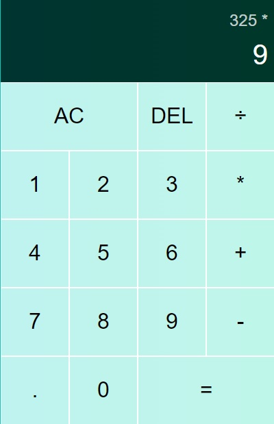

# Calculator

## Table of contents

- [Overview](#overview)
  - [The challenge](#the-challenge)
  - [Screenshot](#screenshot)
  - [Links](#links)
- [My process](#my-process)
  - [Built with](#built-with)
  - [What I learned](#what-i-learned)
  - [Continued development](#continued-development)
- [Author](#author)

# Welcome! 👋

## Overview

### The challenge

Users should be able to:

- Count different types of numbers

### Screenshot

### Links

- Live Site URL: [Github Pages]https://maciekgangus.github.io/calculator/

## My process

### Built with

- Semantic HTML5 markup
- CSS custom properties
- JS script

### What I learned

I learned how to use Java Script simple tasks

### Continued development

I want to focus on adding additional functions like counting binary numbers

## Author

- Github - https://github.com/maciekgangus

